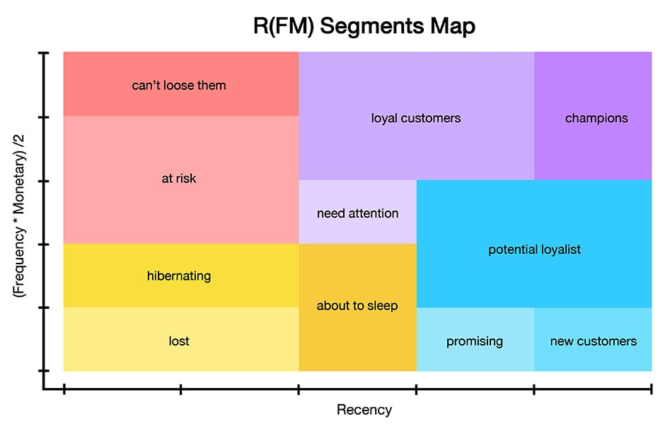

# 🧠 RFM Customer Segmentation for Direct Marketing Optimization

This repository contains a Python-based ETL pipeline for performing **RFM (Recency, Frequency, Monetary)** analysis on customer order data, enriched with demographic, newsletter, and historical segmentation information. The goal is to generate high-value customer segments to guide targeted marketing strategies such as retention, reactivation, and newsletter optimization.

---

## 📊 Project Overview

The script performs the following core tasks:

1. **Data Import & Cleaning**
2. **Data Integration & Customer Merging**
3. **Seasonality Detection (Easter & Christmas buyers)**
4. **Segmentation over a 5-Year Purchase Window**
5. **Scoring: Recency, Frequency, Monetary (weighted)**
6. **Label Assignment for RFM Segments**
7. **Exporting Results to Excel (by segment + summary)**

---

## 🧮 How RFM Is Computed

This implementation goes beyond classic RFM by incorporating weighted recency, temporal decomposition, and enhanced scoring logic:

1. **Recency (R):**

   * Customers are binned into **10 recency groups** instead of 5.
   * Recency is based on the most recent purchase date (`AUF_ANLAGE`), with reference to the current date.

2. **Frequency (F) and Monetary (M):**

   * Only orders from the **last 5 years** are considered.
   * This 5-year window is **split into two periods**:

     * **3–5 years ago**
     * **Last 2 years**
   * Frequency and monetary values are **weighted**, giving recent purchases double the importance:

     ```
     F_5_years = (F_3_to_5_years * 0.5) + F_last_2_years
     M_5_years = (M_3_to_5_years * 0.5) + M_last_2_years
     ```

3. **Scoring System:**

   * `f_score` and `m_score` are calculated by binning the weighted values into 5-score intervals.
   * A **combined MF score** is calculated with higher weight on monetary:

     ```
     mf_score = (f_score + 2 * m_score) / 3
     ```

4. **Segment Label Assignment:**

   * Customers are assigned to a label based on their **recency score (r\_score)** and **MF score**.
   * Labels include:

     * `Champions`
     * `Loyal customers`
     * `At Risk`
     * `Hibernating`
     * ...and others, including:

5. **Non-buyers (Interessenten):**

   * Two special groups are included:

     * **Neu-Interessenten**: Registered <1 year ago, no purchases
     * **Alt-Interessenten**: Registered ≥1 year ago, no purchases

6. **Final RFM Labeling:**

   * Each customer is assigned a final `rfm_label` reflecting behavior, value, and lifecycle stage.

---

## 📁 File Outputs

* `rfm_segments.xlsx`: RFM-labeled customer list split into tabs by segment.
* `rfm_segments_gesamt.xlsx`: Aggregate summary tables (overall and by legacy segmentation).

---

## 🛠️ Dependencies

```bash
pip install pandas xlsxwriter python-dateutil
```

---

## ▶️ How to Run

1. Clone the repo and update paths in `paths.py`.
2. Run the main analysis script:

   ```bash
   python rfm_analysis.py
   ```
3. Review results in `rfm_segments.xlsx` and `rfm_segments_gesamt.xlsx`.


